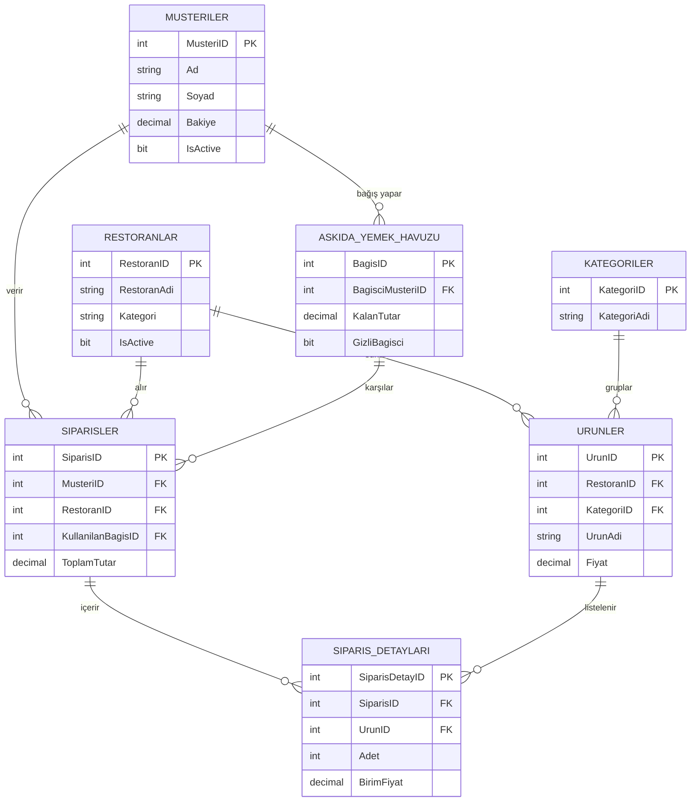

# VTYS-1 Dönem Projesi: Çevrimiçi Yemek Sipariş Platformu Veritabanı Tasarımı Teslim Raporu

**Ad Soyad:** [Adınız Soyadınız]  
**Öğrenci No:** [Öğrenci Numaranız]

## 1. Proje Özeti ve Kapsamı
* **Genel Tanım:** Bu proje, kullanıcıların (müşteriler) sisteme kayıtlı restoranların menülerinden yemek siparişi verebileceği çevrimiçi bir platformun veritabanı altyapısını oluşturur. Sistem; müşteriler, restoranlar, ürünler (menüler) ve sipariş süreçlerini entegre bir şekilde yönetir. Ek olarak, sosyal yardımlaşmayı teşvik etmek amacıyla "Askıda Yemek" isimli bir bağış havuzu modülü barındırır.
* **3NF Uyumluluğu:** Veritabanı yapımız 3. Normal Form (3NF) kurallarına sıkı sıkıya bağlıdır. Örneğin; `Restoranlar` tablosundaki bir restoranın ürünleri virgülle ayrılmış şekilde tek satırda tutulmamış, ayrı bir `Urunler` tablosunda (Foreign Key ile bağlanarak) tutulmuştur (1NF). Verilerde kısmi bağımlılık (2NF) veya geçişsel bağımlılık (3NF) engellenmiştir; siparişte müşterinin sadece ID'si tutulur, adres bilgisi her sipariş satırına tekrar tekrar yazılmaz, `Musteriler` tablosundan çekilir.

## 2. "Askıda Yemek" Modülü – Kurallar
* **Bağış Mantığı:** Hayırsever müşteriler, `AskidaYemekHavuzu` tablosuna belirli bir miktar bakiye bırakarak bağış yaparlar. Bu miktar sistemde havuz bakiyesi olarak saklanır.
* **Gizlilik Kuralları:** `AskidaYemekHavuzu` tablosundaki `GizliBagisci` isimli BIT türündeki (0 veya 1) kolon kullanılmıştır. Eğer bu değer 1 ise, View (Görünüm) içerisinde bu kişinin ismi "Gizli Hayırsever" olarak maskelenir.
* **Yararlanma Şartları:** Bakiyesi yetersiz veya ihtiyaç sahibi olan kullanıcılar, sipariş ekranında `AskidaYemekKullanildi = 1` şeklinde sipariş vererek bu havuzdan yararlanabilirler. Hangi bağıştan yararlandıkları `KullanilanBagisID` ile takip edilir.
* **Bakiye Yönetimi:** Müşteri askıdan sipariş verdiğinde, SQL Server'da oluşturduğumuz `trg_AskidaYemekKullanimi` isimli Trigger devreye girer. Bu trigger, sipariş tutarını otomatik olarak seçili bağışın `KalanTutar` bilgisinden düşer. Eğer bakiye eksiye düşmeye çalışırsa Trigger `ROLLBACK` ile işlemi iptal eder.

## 3. Varlık-İlişki (ER) Diyagramı

* **İlişki Açıklamaları:** 
  - **Müşteriler - Siparişler (1:N):** Bir müşteri birden fazla sipariş verebilir, ama bir sipariş tek müşteriye aittir.
  - **Restoran - Ürünler (1:N):** Bir restoranın birden fazla ürünü vardır.
  - **Siparişler - Sipariş Detayları (1:N):** Bir sipariş (fiş), içinde birden çok ürün barındırabilir. Bu yapı (Siparişler ve Detaylar) aslında Ürünler ile Siparişler arasındaki Çok-Çok (M:N) ilişkiyi çözümlemek için aracı köprü tablosu olarak kullanılmıştır.

## 4. Veri Tanımlama ve Kısıtlamalar (DDL)
* **Tablo Yapıları:** 
  1. `Musteriler` (Sistemi kullananlar), 2. `Restoranlar` (İşletmeler), 3. `Kategoriler` (Menü başlıkları), 4. `Urunler` (Yemekler), 5. `AskidaYemekHavuzu` (Bağış kayıtları), 6. `Siparisler` (Ana fiş/fatura), 7. `SiparisDetaylari` (Fişin içindeki kalemler).
* **Constraint Kullanımı:** 
  - **CHECK:** `Urunler` tablosunda `Fiyat > 0` şartı eklenerek bedava (veya eksi fiyatlı) ürün girişi engellendi. `AskidaYemekHavuzu`'nda `KalanTutar >= 0` check kısıtlamasıyla borçlu duruma düşmesi engellendi.
  - **UNIQUE:** `Musteriler` tablosunda `Email` kolonuna eklenerek aynı e-postayla birden fazla kayıt oluşturulması engellendi.
  - **NOT NULL:** Tabloların temel kimliği olan `Ad`, `Soyad`, `Fiyat` gibi mecburi verilere eklendi.
* **Soft Delete:** Veritabanında hiçbir kayıt fiziksel olarak silinmez (`DELETE FROM` kullanılmaz). Bunun yerine tüm temel tablolarda `IsActive BIT DEFAULT 1` kolonu mevcuttur. Eğer bir restoran kapatılırsa veya ürün menüden kalkarsa, `IsActive = 0` yapılır. Böylece geçmiş sipariş faturaları bozulmaz, tutarlılık sağlanır.

## 5. Veritabanı Programlanabilirlik Nesneleri
* **Görünümler (Views):** 
  1. `vw_AktifMenuler`: Sadece sistemde aktif (IsActive=1) olan restoranların aktif ürünlerini getirerek, uygulamanın anasayfa sorgularını basitleştirdi.
  2. `vw_AskidaYemekHavuzu`: Bağış yapan müşterilerin `GizliBagisci` seçeneğini kontrol edip ekrana "Gizli Hayırsever" veya isimlerinin baş harfini (örn: Ayşe K.) döndürerek karmaşık IF-ELSE mantığını view içerisine hapsetti.
* **Tetikleyiciler (Triggers):** 
  - `trg_AskidaYemekKullanimi`: Sipariş tablosuna veri (`INSERT`) eklendiği anda (AFTER INSERT) tetiklenir. Eğer sipariş "Askıda yemek" havuzundan verilmişse, siparişin toplam tutarını havuzdaki o bağışın `KalanTutar` bakiyesinden otomatik olarak düşer. İş kurallarını otomatize eder.
* **İndeksleme (Index):** 
  - `IDX_Siparisler_SiparisTarihi`: Sipariş tablosundaki tarihe göre azalan index atıldı. Uygulama her açıldığında "Son Siparişler" listelendiği için tablo taraması (Table Scan) yapmadan verilere en hızlı şekilde ulaşılır.

## 6. Analitik Sorgu Senaryoları
* **JOIN Sorgusu:** `Musteriler`, `Siparisler` ve `Restoranlar` tabloları INNER JOIN ile birleştirildi. Amacı: "Hangi müşteri, hangi restorandan sipariş vermiş?" sorusuna yanıt vererek kullanıcı bazlı sipariş fişleri oluşturmaktı.
* **Gruplama ve Agregasyon:** `GROUP BY r.RestoranAdi` ve `HAVING SUM(...) > 200` kullanıldı. Amaç: Restoranların performans analizini yapmak ve sistemde toplam 200 TL üzerinde gelir elde eden "Başarılı" restoranları tespit edip raporlamaktı.
* **Alt Sorgu (Subquery):** `WHERE MusteriID IN (...)` kullanılarak sadece 'Kebap' satan restoranlardan alışveriş yapmış müşteri kitlesi filtrelendi. Amaç: Özel kampanya bildirimleri (Örn: Kebap severlere %10 indirim) atmak için spesifik hedef kitleyi bulmaktı.

## 7. Yapay Zeka (AI) Beyanı
* **Asistan Kullanımı:** Bu proje sürecinde (veritabanı şemasının 3NF yapısına dönüştürülmesi, ER diyagramının kodlanması, örnek test verilerinin `INSERT` scriptlerinin üretilmesi) Gemini (Antigravity Asistan) kullanılmıştır. 
* **Özgünlük Onayı:** AI tarafından üretilen `Soft Delete` mimarisi ve `Askıda Yemek` Trigger mantığı satır satır incelenmiş, SQL Server (SSMS) üzerinde test edilerek sistemin tutarlı çalışıp çalışmadığı manuel olarak kontrol edilmiş ve projeye uyarlanmıştır.

## 8. GitHub ve Versiyonlama
* **Repo Linki:** (Lütfen buraya kendi Github bağlantınızı yapıştırın: `https://github.com/kullaniciadi/CevrimiciYemekSiparisi_VTYS`)
* **Commit Geçmişi:** Projemin klasöründe `git init` ile lokal bir depo oluşturulmuş, DDL (Tablolar), Programlanabilirlik (Trigger/View) ve DML (Örnek veriler) dosyaları ayrı ayrı commit edilerek versiyon kontrol süreçlerine (adım adım geliştirme metodolojisine) sadık kalınmıştır.
